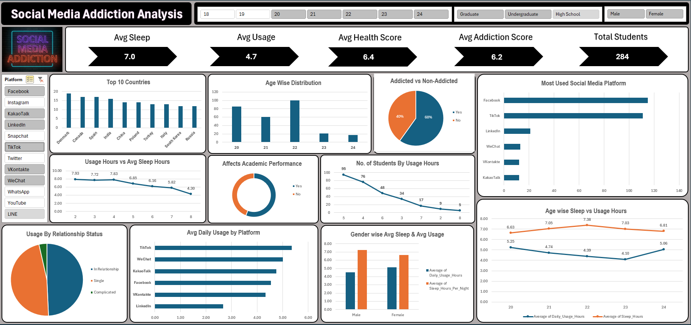

# 📊 Social Media Addiction Dashboard

This project is an interactive Excel dashboard analyzing social media usage patterns among students. It includes insights into:

- Avg sleep, usage, health, and addiction scores
- Country and age-wise usage
- Platform popularity (Facebook, TikTok, etc.)
- Impact on academics and mental health

## 🛠 Tools Used
- Microsoft Excel (Pivot Tables, Slicers, Charts)
- Data Visualization & Storytelling

## 📸 Preview

## 📁 File
- `Social_Media_Analysis_Dashboard.xlsx`

Feel free to explore and suggest improvements!
